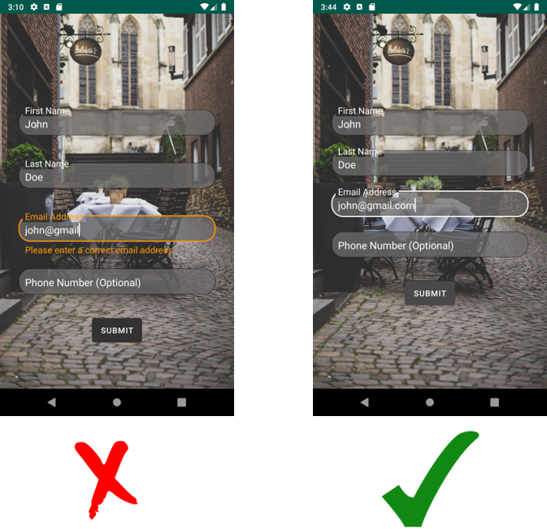
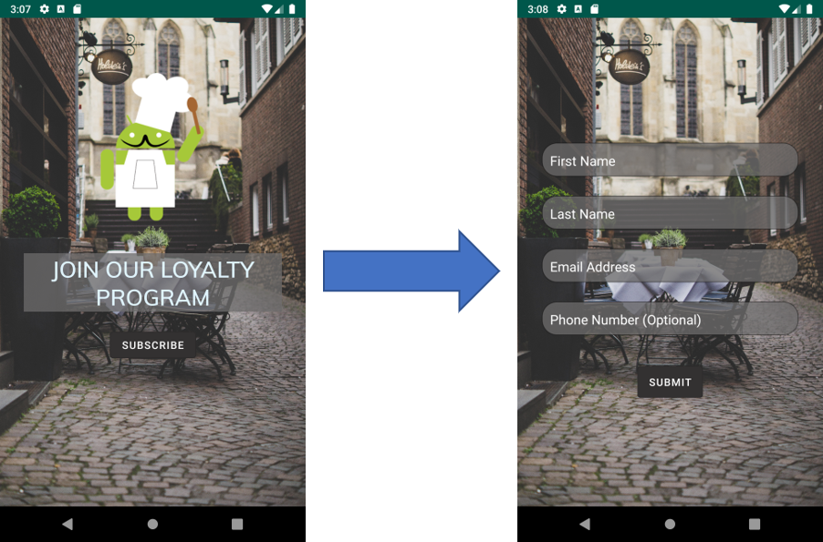
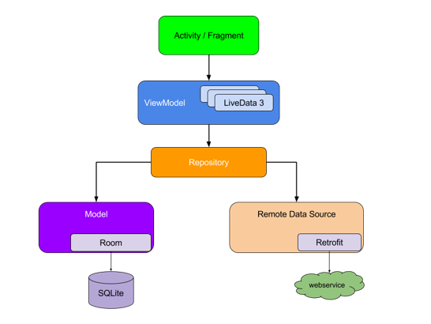
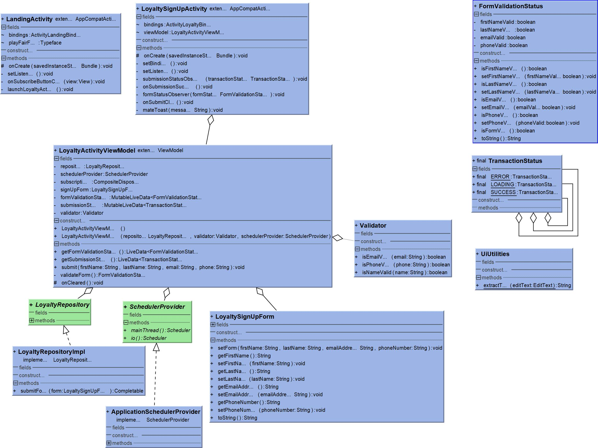

# Loyalty Sign Up Screen

This is a code challenge to develop a sign-up feature for with the following requirements:
- Collect information
    - First name
    - Last name
    - Email address
    - Phone number (Optional)
- The information must be validated before submission.
- Inform the user if there is an error.

# General Design

The app consists only of two Screens:
Landing Screen -> Invites the user to sign up
LoyaltySignUp Screen ->  Handles the sign-up process, the validation, and sending of the information.

The app is implemented using the MVVM pattern to keep the separation of concerns, improve testability, avoid memory leaks and exceptions caused by the activity/fragment lifecycle changes. 

- Activity: It is in charge of updating, processing the UI and communicate to the ViewModel to do the processing like the validation.

- ViewModel: It takes care of all the logic needed to verify the validity of the given information and send the required update instructions to the Activity via LiveData.

- Repository: It is in charge of interact with the data layer of the application, in this case, it will be responsible for sending a POST request through the NetworkService

# LoyaltySignUp feature Specific Design and main classes

- LoyaltySignUpActivity: Besides the initial setting of the UI, it sends the submission instruction to the ViewModel to be validated and posted. Besides, it registers to observe two events; 
    - Changes on the validity of the text fields represented by the FormValidationStatus class, setting the error messages accordingly. 
    - Changes in the status of the submission represented by the TransactionStatus class, updating the UI accordingly;

- LoyaltyActivityViewModel: It is responsible for coordinating the verification and the correspondent actions, the two behaviors:
    - If it notifies via LiveData to the View the validity of the text fields.
    - If the data is valid it subscribes in a different thread to make the Network request and notifies the View if the status is Loading, Success or Error

- Validator: This is the class in charge of the actual checkup of the input information, checking if the name, email, and phone are correct values. The validation was implemented in a separated class to make the ViewModel Testing easier.

- SchedullerProvider: Implementation made specially to test RxJava dependent methods.

- LoyaltyRepository: At this moment the repository only has the submit() function that returns a Completable to simulate the network call making easy to plug the Network service when needed

# Tools and Libraries

To implement MVVM we take advantage of the following components and libraries:
- ViewModels - Helps to avoid memory leaks caused by configuration changes and holds the data from the activity/fragment.
- LiveData - Allow us to have one-way communication between the activity and ViewModel allowing the activity to listen for the changes in the data and react to them without holding references of views in the ViewModel. Thus avoiding possible null pointer exceptions 
- RxJava - This would be used to handle the asynchronous calls to interact with the network service and submit the information to the server 
- Mockito - Used to mock dependencies needed in order to Test our components
- Roboelectric - Help us to unit test classes that depend on Android-specific components using Junit
  
# Next steps and improvements
- Use Dagger to improve the Dependency Injection
- Implement the NetworkService using retrofit
- Improve UI
- Implement Landscape UI
- Check each text field while typing 
- Create Instrumentation Tests
  